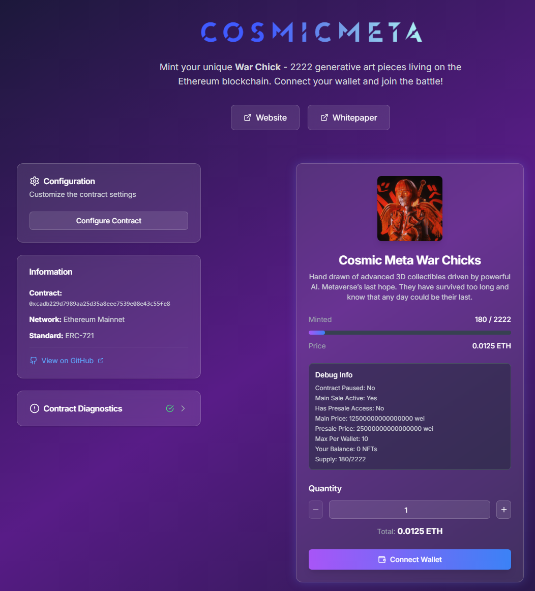
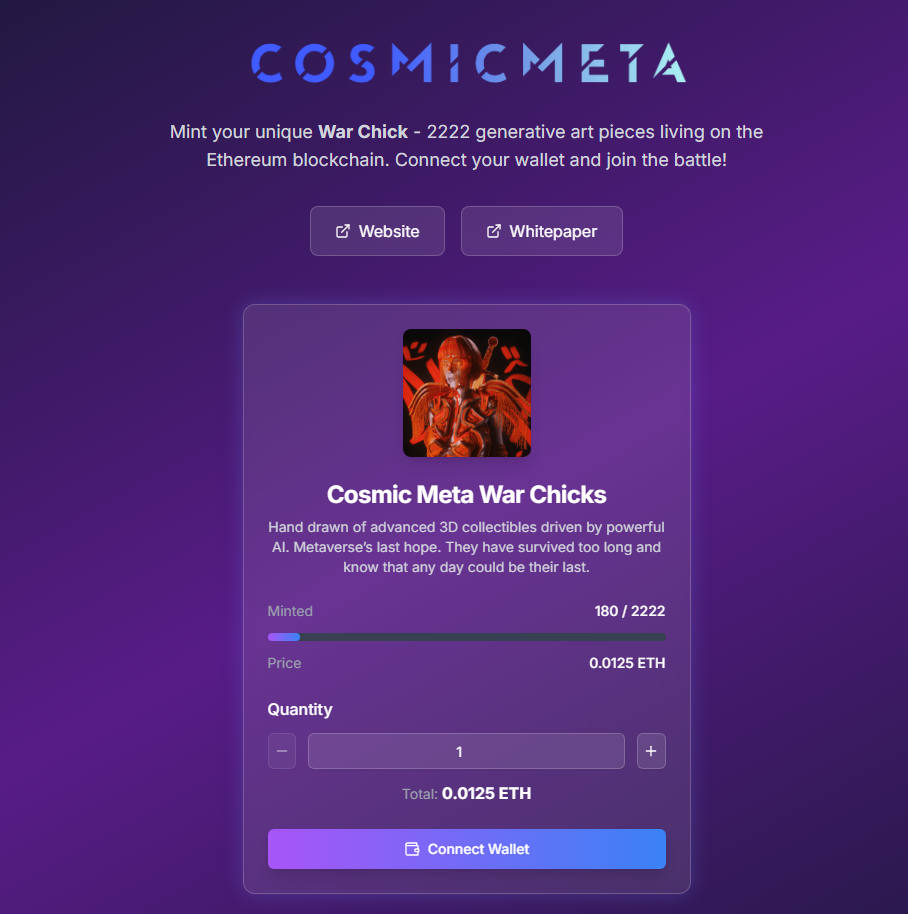

# Generic NFT Minting Dapp

A beautiful, configurable NFT minting interface for any ERC-721 contract. Built with Next.js, TypeScript, and modern Web3 technologies.

**🎯 Key Innovation**: Everything is controlled from **one configuration file** - contract details, branding, deployment paths, and SEO metadata. Deploy multiple NFT collections using the same codebase by simply changing the config!

## ✨ What's New

### 🆕 Centralized Configuration System
- **One file controls everything**: `deployment.config.js`
- Contract address, name, pricing → **UI text, SEO, paths** all update automatically
- **Multi-project ready**: Deploy multiple collections with same codebase
- **Zero configuration errors**: Single source of truth prevents mismatches

## Features

- 🎨 **Beautiful UI**: Modern, responsive design with glass morphism effects
- 🔗 **Multi-Wallet Support**: Connect with MetaMask, WalletConnect, and more
- ⚙️ **Centralized Configuration**: Single file controls all contract and deployment settings
- 🔄 **Multi-Project Ready**: Deploy multiple NFT collections with same codebase
- 🌐 **Multi-Network**: Support for Ethereum, Polygon, Arbitrum, and more
- 📱 **Mobile Friendly**: Fully responsive design
- 🚀 **Fast & Reliable**: Built with Next.js and optimized Web3 libraries
- 🔒 **Secure**: Client-side only, no data collection
- 🖼️ **Local Assets**: Includes custom placeholder image with project branding
- 🔍 **Contract Diagnostics**: Built-in debugging tools to verify contract compatibility
- 🛠️ **Enhanced Error Handling**: Comprehensive error reporting and troubleshooting
- 📡 **Reliable RPC**: Multiple free public RPC endpoints for stable connectivity
- ⚡ **Hydration Safe**: Optimized for server-side rendering with client-side Web3
- 🎛️ **Configurable UI**: Toggle configuration panel for development vs production modes
- 📁 **Static Export Ready**: Generate deployable static files for any web server
- 🛣️ **Subdirectory Deployment**: Deploy to any URL path with automatic asset management

## 📸 Preview

### Development Mode

*Full configuration panel with contract diagnostics, information panel, and minting interface*

### Production Mode  

*Clean, focused minting interface designed for end users*

**Toggle between modes** by changing one line in `src/app/page.tsx`:
```typescript
const ENABLE_CONFIGURATION_PANEL = true;  // Development mode
const ENABLE_CONFIGURATION_PANEL = false; // Production mode
```

## Quick Start

### 1. Installation

```bash
# Clone the repository
git clone https://github.com/your-username/generic-nft-mint.git
cd generic-nft-mint

# Install dependencies
npm install
# or
yarn install
```

### 2. Configuration Setup

#### **📁 Contract & Deployment Configuration**

Edit `deployment.config.js` to configure your NFT project:

```javascript
// deployment.config.js - Single source of truth for everything!
const CONTRACT_ADDRESS = '0xcAdb229D7989Aa25D35A8eEe7539E08E43c55fE8';
const CONTRACT_NAME = 'Cosmic Meta War Chicks';
const CONTRACT_SHORT_NAME = 'War Chicks';
const CONTRACT_SYMBOL = 'CMWC';
const CONTRACT_DESCRIPTION = 'Your collection description here...';
const CONTRACT_MAX_SUPPLY = 2222;
const CONTRACT_PRICE_PER_TOKEN = '12500000000000000'; // 0.0125 ETH in wei
const CONTRACT_MAX_PER_WALLET = 10;

// External links (set to empty string to hide the link)
const WEBSITE_URL = 'https://cosmicmeta.io';
const WHITEPAPER_URL = 'https://docs.cosmicmeta.io/whitepaper';

const DEPLOYMENT_PATH = '/war-chicks'; // URL path: mint.cosmicmeta.io/war-chicks/
```

**This single file controls:**
- ✅ Contract address and settings
- ✅ All UI text and branding
- ✅ External links (website, whitepaper)
- ✅ SEO metadata and social sharing
- ✅ Deployment URL path
- ✅ PWA manifest generation

#### **🔐 Environment Variables**

```bash
# Create environment file
touch .env.local

# Add your WalletConnect Project ID
echo "NEXT_PUBLIC_WALLET_CONNECT_PROJECT_ID=your_project_id_here" >> .env.local
```

**Required Environment Variables:**

```env
# WalletConnect Project ID (Required for wallet connections)
NEXT_PUBLIC_WALLET_CONNECT_PROJECT_ID=your_project_id_here
```

**Get a free WalletConnect Project ID:**
1. Visit [https://cloud.walletconnect.com](https://cloud.walletconnect.com)
2. Create a free account
3. Create a new project
4. Copy your Project ID to `.env.local`

### 3. Run the Development Server

```bash
npm run dev
# or
yarn dev
```

Open [http://localhost:3000](http://localhost:3000) in your browser.

## Configuration

### 🎯 Centralized Configuration System

**Everything is controlled from ONE file: `deployment.config.js`**

### Contract & Project Setup

Edit `deployment.config.js` to configure your entire NFT project:

```javascript
// deployment.config.js
const CONTRACT_ADDRESS = '0xcAdb229D7989Aa25D35A8eEe7539E08E43c55fE8';
const CONTRACT_NAME = 'Your Amazing NFT Collection';
const CONTRACT_SHORT_NAME = 'Amazing NFTs';
const CONTRACT_SYMBOL = 'ANFTS';
const CONTRACT_DESCRIPTION = 'A stunning collection of unique digital art pieces...';
const CONTRACT_MAX_SUPPLY = 5000;
const CONTRACT_PRICE_PER_TOKEN = '50000000000000000'; // 0.05 ETH in wei
const CONTRACT_MAX_PER_WALLET = 5;
const DEPLOYMENT_PATH = '/amazing-nfts'; // URL: yoursite.com/amazing-nfts/
```

### What Updates Automatically

When you change `deployment.config.js`, these update automatically:

**🎨 UI & Branding:**
- Page titles and descriptions
- Header text and logo alt text
- Collection name and supply count
- External links (website, whitepaper buttons)

**🔧 Technical Configuration:**
- Contract address and parameters
- Deployment URL path
- Asset paths and resources

**📱 SEO & Social Media:**
- Meta tags and descriptions
- Open Graph images and titles
- PWA manifest file

**🌐 Multi-Project Deployment:**
- Deploy same codebase for different collections
- Each with unique branding and configuration
- Different URL paths: `/collection1`, `/collection2`, etc.

### 🔄 Multi-Project Example

Deploy multiple NFT collections using the same codebase:

**War Chicks Collection:**
```javascript
// deployment.config.js
const CONTRACT_ADDRESS = '0xcAdb229D7989Aa25D35A8eEe7539E08E43c55fE8';
const CONTRACT_NAME = 'Cosmic Meta War Chicks';
const CONTRACT_SHORT_NAME = 'War Chicks';
const WEBSITE_URL = 'https://warchicks.cosmicmeta.io';
const WHITEPAPER_URL = 'https://docs.cosmicmeta.io/war-chicks';
const DEPLOYMENT_PATH = '/war-chicks';
```
👆 Deploys to: `mint.cosmicmeta.io/war-chicks/`

**Zombies Collection:**
```javascript
// deployment.config.js  
const CONTRACT_ADDRESS = '0x1234567890abcdef1234567890abcdef12345678';
const CONTRACT_NAME = 'Cosmic Meta Zombies';
const CONTRACT_SHORT_NAME = 'Zombies';
const WEBSITE_URL = 'https://zombies.cosmicmeta.io';
const WHITEPAPER_URL = 'https://docs.cosmicmeta.io/zombies';
const DEPLOYMENT_PATH = '/zombies';
```
👆 Deploys to: `mint.cosmicmeta.io/zombies/`

**Same codebase, different collections! Just change the config file! 🚀**

### 🔗 External Links Configuration

Add website and whitepaper links that appear as styled buttons in the header:

```javascript
// deployment.config.js
const WEBSITE_URL = 'https://yourproject.com';          // Main project website
const WHITEPAPER_URL = 'https://docs.yourproject.com';  // Whitepaper/documentation

// Set to empty string to hide a link:
const WEBSITE_URL = '';        // Hides website button
const WHITEPAPER_URL = '';     // Hides whitepaper button
```

**Features:**
- ✅ **Conditional Display**: Links only show if URL is provided
- ✅ **Styled Buttons**: Glass morphism design matching the UI
- ✅ **Hover Effects**: Blue hover for website, purple for whitepaper
- ✅ **External Link Icons**: Clear visual indication of external links
- ✅ **Security**: `target="_blank"` with `rel="noopener noreferrer"`

### Production UI Toggle

Control the configuration panel visibility:

```typescript
// src/app/page.tsx
const ENABLE_CONFIGURATION_PANEL = false; // Set to true for development
```

**Development Mode** (`ENABLE_CONFIGURATION_PANEL = true`):
- ✅ Shows configuration panel in left sidebar
- ✅ Contract diagnostics available
- ✅ Information panel with contract details
- ✅ 3-column layout (sidebar + minting interface)


*Development Mode - Full configuration panel with diagnostics and contract information*

**Production Mode** (`ENABLE_CONFIGURATION_PANEL = false`):
- 🎯 Clean, simplified UI
- 🎯 Minting interface centered and full-width
- 🎯 No configuration options visible to end users
- 🎯 Perfect for production deployments


*Production Mode - Clean, focused minting interface for end users*

### Required Contract Functions

Your ERC-721 contract should implement these functions:

```solidity
// Read functions
function name() external view returns (string memory);
function symbol() external view returns (string memory);
function totalSupply() external view returns (uint256);
function MAX_TOKENS() external view returns (uint256);
function price() external view returns (uint256);
function mainSale() external view returns (bool);
function balanceOf(address owner) external view returns (uint256);

// Write functions
function mint(address _to, uint256 _quantity) external payable;
```

### Optional Functions (Enhanced Features)
```solidity
// Enhanced minting features
function paused() external view returns (bool);
function maxMint() external view returns (uint256);
function preMintPrice() external view returns (uint256);
function preMint(address _to, uint256 _quantity) external payable;
function hasPresaleAccess(address wallet) external view returns (bool);
```

## Contract Diagnostics

The application includes a **built-in diagnostics tool** to help debug contract compatibility issues:

### Features
- ✅ **Address Validation**: Verifies contract address format
- 🌐 **Network Detection**: Confirms network connectivity
- 🔍 **Function Testing**: Tests basic ERC721 functions (`name`, `symbol`, `totalSupply`)
- 📊 **Real-time Status**: Shows live contract status
- 🔄 **Collapsible Interface**: Expandable diagnostics panel (initially closed)

### How to Use
1. The diagnostics panel appears in the left sidebar
2. Click on "Contract Diagnostics" to expand
3. Green ✅ icons indicate working functions
4. Red ❌ icons show errors with detailed messages
5. Use the diagnosis summary for troubleshooting guidance

### Common Status Messages
- ✅ **All tests pass**: Contract is compatible and ready to use
- ❌ **Contract not found**: Invalid address or wrong network
- ⚠️ **Partial compatibility**: Basic functions work, but custom functions may need ABI updates

## Supported Networks

- Ethereum Mainnet
- Polygon
- Arbitrum
- Optimism
- Goerli (Testnet)
- Sepolia (Testnet)

## Customization

### Styling
- Edit `src/app/globals.css` for global styles
- Modify Tailwind configuration in `tailwind.config.js`
- Customize components in `src/components/`

### Placeholder Image
- Replace `public/nft-placeholder.svg` with your collection's image
- Update the `image` field in the default configuration (`src/app/page.tsx`)
- Supports any web-compatible image format (SVG, PNG, JPG, etc.)

### Contract ABI
If your contract has different function names, update the ABI in:
- `src/lib/contract-abi.ts`

### Add New Networks
Edit the network configuration in:
- `src/components/providers.tsx`

## Deployment

### 🚀 Quick Deployment Commands

The build process automatically generates the PWA manifest and configures all paths:

```bash
# Development server
npm run dev                    # Generates manifest + starts dev server

# Production build (with server)
npm run build                  # Generates manifest + builds for platforms like Vercel

# Static export (for file upload)
npm run deploy                 # Generates manifest + creates /out folder for upload
```

### Platform-Specific Deployment

#### **Vercel (Recommended for dynamic hosting)**

```bash
# Build and deploy
npm run build
npx vercel
```

#### **Static File Hosting (cPanel, Apache, Nginx, etc.)**

```bash
# Generate static files
npm run deploy

# Upload the /out folder contents to your web server
# See STATIC-DEPLOYMENT.md for detailed instructions
```

#### **Other Platforms (Netlify, AWS, etc.)**

```bash
# Build for production
npm run build

# Start production server (if needed)
npm start
```

### 📁 Deployment Path Configuration

Change deployment URL by editing ONE line in `deployment.config.js`:

```javascript
const DEPLOYMENT_PATH = '/your-collection';  // yoursite.com/your-collection/
const DEPLOYMENT_PATH = '';                  // yoursite.com/ (root domain)
```

All assets, metadata, and paths update automatically! ✨

## Technologies Used

- **Framework**: Next.js 14 with App Router
- **Language**: TypeScript
- **Styling**: Tailwind CSS with Glass Morphism effects
- **Web3**: Wagmi, Viem, RainbowKit
- **RPC Providers**: Multiple free public endpoints (Cloudflare, PublicNode, 1RPC, Builder0x69)
- **Icons**: Lucide React
- **State Management**: React Hooks (useState, useEffect)
- **Error Handling**: Custom error boundaries and diagnostics
- **Components**: Collapsible UI, Client-side only rendering
- **Package Manager**: npm/yarn

## Key Components

- **MintInterface**: Main minting component with wallet integration
- **ContractDiagnostics**: Real-time contract testing and debugging
- **ClientOnly**: Prevents hydration errors with Web3 components
- **Providers**: Web3 provider configuration with multiple RPC endpoints

## Contract Requirements

Your NFT contract should be ERC-721 compatible and include:

1. **Public minting function**: `mint(address _to, uint256 _quantity) payable`
2. **Price getter**: `price() returns (uint256)`
3. **Supply tracking**: `totalSupply()` and `MAX_TOKENS()`
4. **Sale status**: `mainSale() returns (bool)`

## Security Considerations

- This is a client-side application - no private keys are stored
- Always verify contract addresses before minting
- Test on testnets before mainnet deployment
- Users should verify transaction details in their wallet

## Troubleshooting

### Common Issues

**ABI Encoding Error**: 
- Ensure your contract's `mint` function signature matches: `mint(address _to, uint256 _quantity)`
- Verify function names match the ABI: `price()`, `mainSale()`, `MAX_TOKENS()`

**RPC/Connection Issues**:
- **HTTP 401 Unauthorized**: The app uses free public RPC endpoints that don't require API keys
- **Internal Error**: Usually indicates RPC provider issues or invalid contract address
- **Missing WalletConnect Project ID**: Add `NEXT_PUBLIC_WALLET_CONNECT_PROJECT_ID` to `.env.local`

**Hydration Errors**:
- The app uses `ClientOnly` components to prevent server-side rendering issues
- If you see hydration mismatches, ensure you're not importing Web3 components on the server
- Refresh the page if wallet connection state appears inconsistent

**Contract Diagnostics Errors**:
- **Red ❌ Contract not found**: Verify the contract address and ensure you're on the correct network
- **Network not connected**: Connect your wallet or check network configuration
- **Function call failures**: Contract may not implement required ERC721 functions

**Transaction Failures**:
- Ensure sufficient ETH balance for gas fees and mint price
- Check if public sale is active on the contract
- Verify you haven't exceeded max tokens per wallet
- Use Contract Diagnostics to verify contract state

### Advanced Debugging

**Use Contract Diagnostics**:
1. Click on "Contract Diagnostics" in the sidebar
2. Check each test result for specific error messages
3. Use the diagnosis summary for troubleshooting guidance

**Console Logs**:
- Open browser developer tools (F12)
- Check the Console tab for detailed error messages
- Look for Web3 provider connection issues

**RPC Provider Debugging**:
The app tries multiple RPC providers in this order:
1. Cloudflare ETH (`https://cloudflare-eth.com`)
2. PublicNode (`https://ethereum-rpc.publicnode.com`)
3. 1RPC (`https://1rpc.io/eth`)
4. Builder0x69 (`https://rpc.builder0x69.io`)
5. Wagmi Public Provider (fallback)

## Contributing

1. Fork the repository
2. Create a feature branch: `git checkout -b feature-name`
3. Commit changes: `git commit -am 'Add feature'`
4. Push to branch: `git push origin feature-name`
5. Submit a Pull Request

## License

MIT License - see [LICENSE](LICENSE) file for details.

## Support

- Create an issue on GitHub for bugs
- Join our Discord for community support
- Check the documentation for common questions

---

Built with ❤️ for the Web3 community 
Built with ❤️ for the Web3 community 